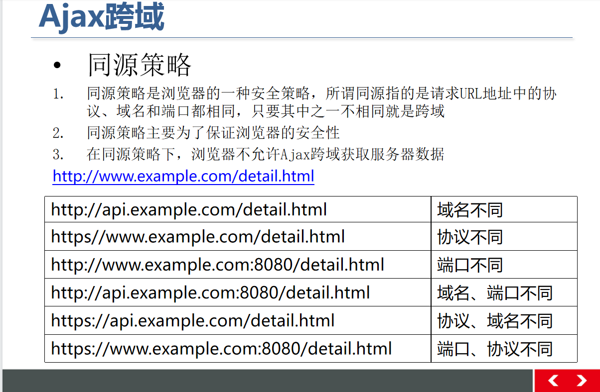

<h1 align="center">跨域问题</h1>

#### 注意：

jsonp只支持get。浏览器中显示的post 十分误导我们；
这里可以联系到 jsonp最终是将数据以类似src标签的方式加载，而这种加载方式的确是只有get方式；
jsonp请求，一定不要误以为是post，需要找到参数拼接称get请求即可；
get方式请求后转换为json格式即可正常使用；


本地主机 http://localhost 无法直接申请ajax跨域访问http://tom.com




- #### 静态script标签的src属性进行跨域请求

- #### 动态创建script标签，通过标签的src属性发送请求


<h4>直接使用ajax跨域访问会报错：</h4>

```html
<!DOCTYPE html>
<html lang="en">

<head>
    <meta charset="UTF-8">
    <meta http-equiv="X-UA-Compatible" content="IE=edge">
    <meta name="viewport" content="width=device-width, initial-scale=1.0">
    <title>Document</title>
</head>

<body>
    <input type="text" id="name" name="name" placeholder="2" value="123">
    <input type="button" id="btn" value="按钮">
    <script src="../jquery/jquery.js"></script>
    <script>
        $('#btn').click(function() {
            var data = $('#name').val();
            $.ajax({
                type: 'POST',
                // 跨域不能成功：localhost不能跨域到tom
                url: 'http://tom.com',
                data: data,
                success: function(data) {
                    alert('success');
                    console.log(data);
                },
                error: function() {
                    console.log('falure');
                }

            })
        })
        
        /*会报错   : 
       Access to XMLHttpRequest at 'http://tom.com/' from origin 'http://localhost' has been blocked by CORS policy: No 'Access-Control-Allow-Origin' header is present on the requested resource.*/
    </script>
    
    
</body>

</html>
```


<h4>1.用静态的src属性进行跨域请求：</h4>


- http://tom.com/01.php

```php
<?php
    echo 'var a=10';

	//注：直接 echo 10; 是无法访问返回的数据的，必须用js语句，让后面可以访问到返回的数据
?>
```

- http://locahost/01.html:

```html
<!DOCTYPE html>
<html lang="en">

<head>
    <meta charset="UTF-8">
    <meta http-equiv="X-UA-Compatible" content="IE=edge">
    <meta name="viewport" content="width=device-width, initial-scale=1.0">
    <title>Document</title>
</head>

<body>
    <input type="text" id="name" name="name" placeholder="2" value="123">
    <input type="button" id="btn" value="按钮">
    
    <!-- 用静态src请求跨域访问是被允许的 -->
    
    <script src="http://tom.com/01.php"></script>
    <script>
        console.log(a);//10
    </script>
</body>

</html>
```


async属性默认异步加载资源       

`<script async type="text/javascript" src="http://tom.com/data.php?flag=1">`

浏览器会把script标签src的请求放在异步执行栈

### 动态获取跨域标签


- http://tom.com/01.php

```php
<?php
    //也是不能直接访问数据，要通过js代码访问：可以用函数：返回调用函数.函数名必须定义，否则报错
    echo 'foo(123)';
?>
```


- http://locahost/01.html:

```html
<!DOCTYPE html>
<html lang="en">

<head>
    <meta charset="UTF-8">
    <meta http-equiv="X-UA-Compatible" content="IE=edge">
    <meta name="viewport" content="width=device-width, initial-scale=1.0">
    <title>Document</title>
</head>

<body>
    <input type="text" id="name" name="name" placeholder="2" value="123">
    <input type="button" id="btn" value="按钮">
    <script src="../jquery/jquery.js"></script>
    <script>
        $('#btn').click(function() {
            var script=docment.createElement('script');
    		script.src='http://tom.com/01.php?falg=1';//flag值可以以变量传递
    		var head=document.getElementByTagName('head')[0];
            head.appendChild(script);
            
            //php 返回 foo(123);直接调用 js 的foo 函数，实现访问返回的后台数据
            function foo(data){
                console.log(data);//123
            }
    		
        })
        
    </script>
    
    
</body>

</html>
```


### 解决函数名可能不统一问题


##### JSONP的本质：动态创建script，通过src跨域发送请求。并返回函数调用


```php
<?php
    //获取前端url返回的函数名字   得和url传过来的统一。不一定得是callback
    $func=$_GET['callback'];
	echo $func.'(123)';//返回函数调用

	//如果是返回json形式：    echo '('.'{"key":"'.$key.',"value":"'.$value'".'}'.')';
?>
```


```javascript
$('#btn').click(function() {
            var script=docment.createElement('script');
            
    		script.src='http://tom.com/01.php?callback=foo';//传递callback的名字
    		var head=document.getElementByTagName('head')[0];
            head.appendChild(script);
            
            //php 返回 foo(123);直接调用 js 的foo 函数，实现访问返回的后台数据
            function foo(data){
                console.log(data);//123
            }
    		
        })
```

