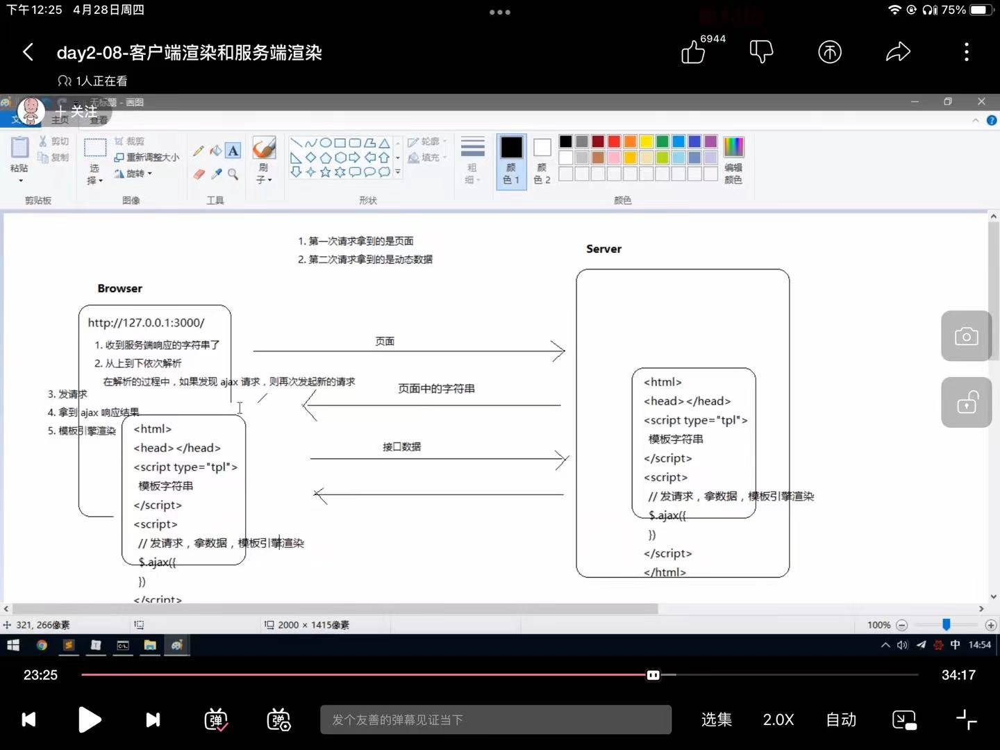
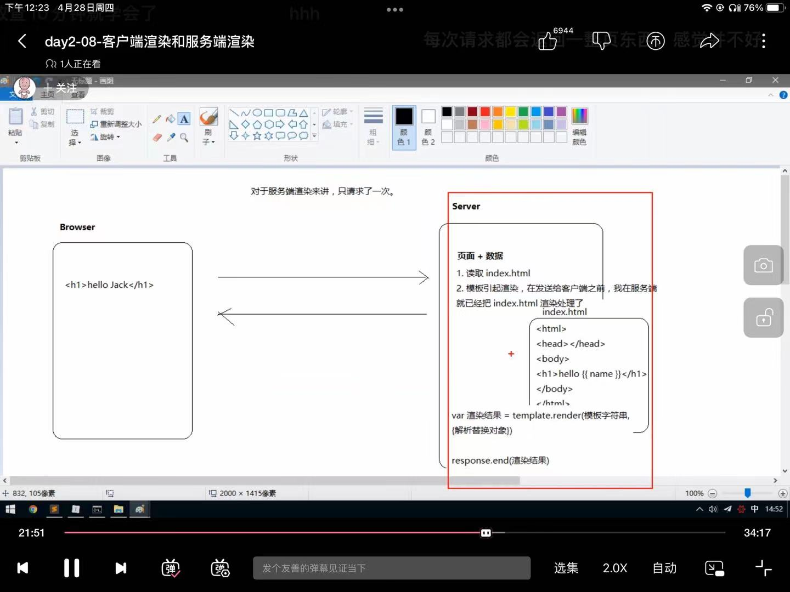

# 服务器渲染和客户端渲染

**区别**

（ 服务器渲染 ：模板引擎替换{{ name }}并用response.end()直接输出）：传输更快

（ 客户端渲染：AJAX异步渲染 ）

- 客户端渲染不利于SEO搜索引擎优化( AJAX异步渲染 )
- 服务端渲染是可以被爬虫抓取到的，客户端异步渲染是很难被爬虫抓取到的
- 真正的网站不是纯异步或者纯服务器端渲染出来的，而是立啊这结合来做的
- 比如京东的商品列表就才用的服务端渲染，目的就是为了SEO搜索引擎优化（ 为了赚钱 ）
- 而他的商品评论为了用户体验，而且也不需要SEO优化，所以采用的是客户端渲染

#### 注：

**怎么查看网页是用的服务器渲染还是客户端渲染：**

- 右键点击查看网页源代码：如果数据都是可以从源代码找到的就是用服务器渲染；

- 如果没有就是用ajax的客户端渲染，只能通过右键检查，查看动态添加的元素

