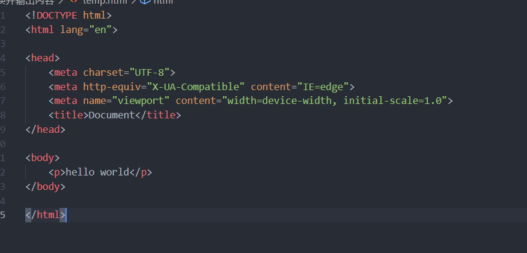

**node没有DOM和BOM**


### require

- require是一个方法：用来加载模块
- 在node中模块有三种：

​		1、具体的核心模块，例如 fs ，http	( 别人帮我们封装好了 ，直接使用就好)

` var fs = require('fs');`

​		2、用户自己编写的文件模块，(相对路径必须加 ./  ;  可以省略后缀名)


#### 文件操作


readFile( './index.js',()=>{} )

第一个参数的  ' ./ '  表示在node终端所属的终端路径


```javascript
var fs = require('fs');


//读文件：
//fs.readFile 接收俩个参数，第一个是操作的文件的相对路径(./ 必须加)，第二个是一个回调函数

//回调函数有俩个参数，error报错信息和data返回的数据信息
//如果错误，则error显示报错信息，data显示undefined；//如果没错，error显示null，data显示返回的信息
fs.readFile('./data/hello.txt',(error,data)=>{
   //返回的信息为<Buffer 68 65 6c0a>  =====>buffer   文件中存储的都是二进制信息，转为16进制，可以通过toString方法转为字符串
    console.log(data.toString());
})

//写文件：
//fs.writeFile 接收三个参数，第一个是文件路径，第二个是文件内容，第三个是回调函数
//回调函数有个error错误信息参数
fs.writeFile('./data/world.txt','hello世界',(error)=>{
             console.log(error);
})

//删除文件：
//fs.unlink

//删除目录
//fs.rmdir
```


=======================================================================================

#### 自己写的文件

```javascript
//01.js导出
var hello= 'helloworld';
exports.hello=hello;//导出


//其他文件引用
var hello=require('./01.js');//是一个对象{},如果没有传默认为{}（空对象）
console.log(hello.hello)//helloworld

```


- 创建目录

```javascript
// 文件操作 初始化目录

let url = 'D:/users/admin/Desktop/前端/学习2/nodeJs';

// 调用核心模块
const path = require('path');
const fs = require('fs');

// 初始化目录
let initData = {
        projectName: 'myDemo',
        data: [{
            name: 'js',
            type: 'dir'
        }, {
            name: 'css',
            type: 'dir'
        }, {
            name: 'img',
            type: 'dir'
        }, {
            name: 'index.html',
            type: 'file'
        }]
    }
    // fs.rmdir(path.join(url, initData.projectName), (err) => {
    //         console.log('错误');
    //     })
    //创建项目跟路径
fs.mkdir(path.join(url, initData.projectName), (err) => {
    //已经存在则报错
    if (err) { console.log('错误'); return }
    initData.data.forEach((item) => {
        if (item.type == 'dir') {
            //Sync  ===>  同步
            fs.mkdirSync(path.join(url, initData.projectName, item.name));
        } else if (item.type == 'file') {
            fs.writeFile(path.join(url, initData.projectName, item.name), 'hello世界', (error) => {
                console.log(error);
            });
        }
    })
})
```


=======================================================================================

#### http

```javascript
// http请求
var http = require('http');

var server = http.createServer(); //类似创建一个联网的服务器

// request 请求事件处理函数，需要接受俩个参数
// request 请求对象：可以获取客户端的一些请求信息，例如请求路径 request.url ( 哪个文件夹 默认是 / )
// response 响应对象：可以用来给客户端发送响应信息
server.on('request', (request, response) => {
    let url = request.url; //访问http://127.0.0.1:3000/ url就是/ ；访问http://127.0.0.1:3000/login url就是/login 
    console.log("收到客户端的请求了?" + url);

    // 因为电脑是中文操作系统gbk，去解析utf-8的数据会出现乱码，需要设置请求头信息
    response.setHeader('Content-Type', 'text/plain;charset=utf-8'); //text/plain文本信息，如果要解析成html页面，需要用text/html

    response.write('不需要用write，直接用end就行');
    // response.end给访问的页面响应数据,只能响应字符串或者二进制文件，不能响应数组对象等，JSON.stringify()转化为字符串
    response.end('helloworld');
})

// server.listen第一个参数是端口号( 尽量不要占用在用的端口 )
server.listen('3000', () => {
    console.log('服务器启动成功,端口号是3000'); //http://127.0.0.1:3000/
}
```

##### http拓展1-（不同的url响应不同的数据)

- server.on的回调函数获得用户的信息：  `console.log('客户申请访问的主机ip地址：' + request.socket.remoteAddress + ' 客户访问的端口：' + request.socket.remotePort);`


```javascript
var http = require('http');

var server = http.createServer();

server.on('request', (req, res) => {
    let json = {
        "username": "张三",
        "age": "18"
    };

    console.log('客户申请访问的主机ip地址：' + req.socket.remoteAddress + ' 客户访问的端口：' + req.socket.remotePort);

    if (req.url === '/') {
        res.setHeader('Content-Type', 'text/plain;charset=utf-8');
        //res.end()  只能响应字符串，不能响应数组对象等，需要用JSON.stringify 把对象转化为字符串
        res.end(JSON.stringify(json));
    } else if (req.url === '/html') {
        res.setHeader('Content-Type', 'text/html;charset=utf-8');
        res.end('<h1>使用了html语言</h1>');
    } else {
        res.setHeader('Content-Type', 'text/html;charset=utf-8');
        res.end('<h1>404 页面NOFOUND</h1>');
    }

})

server.listen('3000', () => {
    console.log('listening on');
})
```


##### http发送不同的页面

```javascript
// 响应发送不同页面
var http = require('http');
var fs = require('fs');

var server = http.createServer();
server.on('request', (req, res) => {
    let url = req.url; //url 统一资源定位符 ：一个url最终对应一个资源
    if (url === '/') { //http://127.0.0.1:3000/
        res.end('helloworld');
    } else if (url === '/html') { //http://127.0.0.1:3000/html
        res.setHeader('Content-Type', 'text/html;charset=utf-8');
        //不要这么写：
        // res.end(`<!DOCTYPE html><html lang="en"><head><<title>Document</title></head><body><p>helloworld</p></body></html>`);
        fs.readFile('./html/01.html', 'utf-8', (err, data) => {
            if (err) {
                res.setHeader('Content-Type', 'text/plain;charset=utf-8');
                res.end('文件读取失败');
            } else {
                // data默认是二进制数据，可以通过toString()方法转为字符串
                // res.end()接收俩个数据类型：字符串和二进制
                res.setHeader('Content-Type', 'text/html;charset=utf-8')
                res.end(data);
            }
        })
    } else if (url === '/img') { //http://127.0.0.1:3000/img

        //读取其他文件
        fs.readFile('./img/01.jpg', (error, data) => {
            if (error) {
                res.setHeader('Content-Type', 'text/plain;charset=utf-8');
                res.end('文件读取失败');
            } else {
                res.setHeader('Content-Type', 'image/jpg'); //不需要传递编码，不然会出问题
                res.end(data);
            }
        })
    }
});
server.listen('3000', () => {
    console.log('listening on...')
})
```


##### 读取文件 

```javascript
var fs=require('fs');

var wwwDir = 'D:/users/admin/Desktop/前端/学习2/nodeJs/www';

//readdir会读取到该目录下的所有文件名带后缀，比如hello.txt
fs.readdir(wwwDir,(err,data)=>{
    
})
```


##### 输出并且替换呈现给用户的内容

```javascript
const { error } = require('console');
var fs = require('fs');
var http = require('http');
var server = http.createServer();

server.on('request', (error, response) => {
    var url = response.url;
    fs.readFile('./temp.html', (err, data) => {
        if (err) { return response.end('404NOTFOUND'); }

            content = "";
            // files.forEach((item) => {

            // })
            response.setHeader('Content-Type', 'text/html,charset=utf-8');
            data = data.toString();
            data = data.replace('hello world', '^__^'); //helloworld被替换成了^__^

            response.end(data);
        })

    })
})
server.listen('3000', () => {
    console.log('listening on....');
})
```


temp.html的代码



 **网页输出为  ^__^**

``` 思路
思路是：
自己开启一个服务器；并且当用户访问时，服务器读取需要输出的网页：(用readFile)
然后读取到的数据转化为字符串；用string.replace('需要替换的内容','替换后的内容')
最后用response.end(string)给用户输出界面
```

 
