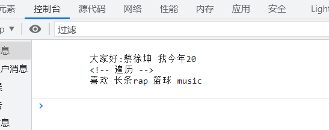

## 模1·板引擎


#### **模板引擎的使用**

```html
<!DOCTYPE html>
<html lang="en">

<head>
    <meta charset="UTF-8">
    <meta http-equiv="X-UA-Compatible" content="IE=edge">
    <meta name="viewport" content="width=device-width, initial-scale=1.0">
    <title>Document</title>
</head>

<body>
    
    
    <script src="../node_modules/art-template/lib/template-web.js">
    //找到node_modules/art-template/lib/template-web.js并且引用
    </script>

    
    <!-- 不写 type="text/javascript"  防止把代码街解析成JavaScript
    //模板引擎用{{}}两个大括号括起来，里面是属性名字-->
    <script type="text/template" id="tpl">
    
        大家好:{{name}} 我今年{{age}}
        <!-- 遍历 -->
        喜欢{{each hobbies}} {{$value}}{{/each}}
    </script>

    <script>
        var ret = template('tpl', {
            name: '蔡徐坤',
            age: '20',
            hobbies: [
                '长条rap',
                '篮球',
                'music'
            ]
        })
        console.log(ret);
    </script>
</body>

</html>
```


***在浏览器控制台输出：***



##### 注意:

- 在网上下载template模板引擎到需要使用的目录位置||或者直接在该目录的code下写 npm install art-template --save
- 需要在html用script标签引用node_modules/art-template/lib/template-web.js
- 模板引擎用{{}}两个大括号括起来，里面是属性名字
- 后面再将使用对象用值一一对应
- 模板引擎会自动识别并且用值填充这些{{}}里面的属性名
- **用来给用户输出变化的值（ 后端给前端填充值 ）**


#### 在js中直接用require使用模板引擎

```javascript
// 模板引擎 在node里面用require('art-template');就可以


var template = require('art-template');

var ret = template.render('hello{{name}}', { name: 'John' });

console.log(ret); //helloJohn

var fs = require('fs');

fs.readFile('./js模板.html', (err, data) => {
    if (err) return console.error('读取文件异常');

    // 模板引擎读的是字符串类型的，而file得到的是是二进制或者十六进制，需要用toString()方法转化为字符串
    ret = template.render(data.toString(), {
        name: '蔡徐坤',
        age: '20',
        hobbies: [
            '唱跳rap',
            '篮球',
            'music'
        ]
    })

    console.log(ret);
    //输出:===================>
	//     <!DOCTYPE html>
    // <html lang="en">

    // <head>
    //     <meta charset="UTF-8">
    //     <meta http-equiv="X-UA-Compatible" content="IE=edge">
    //     <meta name="viewport" content="width=device-width, initial-scale=1.0">
    //     <title>Document</title>
    // </head>

    // <body>
    //     <p> 大家好:蔡徐坤 我今年20</p>
    //     <p>喜欢唱跳rap篮球music</p>
    // </body>

    // </html>
})
```

html的js模板.html：

```html
<!DOCTYPE html>
<html lang="en">

<head>
    <meta charset="UTF-8">
    <meta http-equiv="X-UA-Compatible" content="IE=edge">
    <meta name="viewport" content="width=device-width, initial-scale=1.0">
    <title>Document</title>
</head>

<body>
    <p> 大家好:{{name}} 我今年{{age}}</p>
    <p>喜欢{{each hobbies}} {{$value}}{{/each}}</p>
</body>

</html>
```


最后直接在服务器端输出就可

### 判断：

```javascript
{{ if age > 18  }}
	your code...
{{ else if age < 15 }}
	your code...
{{ else }}
 	your code...
{{ /if }}
// /if  不能写成  / if

```


### 循环

```html
{{each arr }}
	下标：{{ $index }}//默认
	值：{{ $value }}//默认
{{/each}}
  
// 或者，给$value和$index起别名（推荐），好处就是在多层循环时，可以区分变量
  
{{each arr v i  }}
  下标：{{ i }}
  值：{{ v }}
{{/each}}

```


