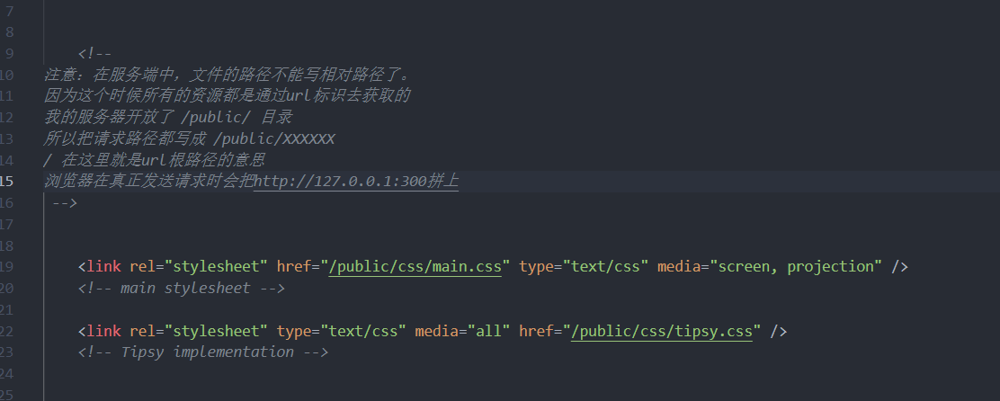

## 注意

​	

- 所有的 src 或者 href（ css link ）都是静态资源，浏览器会从上往下同步获取

- 如果用服务端渲染页面  -  申请访问服务器某个资源都需要在服务器开放权限( 否则会一直处于挂起状态，访问不到权限 )
- 开放权限 **指的是** ==>  res.readFile( ' ',( err , data )=>{ } );

- 服务端用readFile访问html页面中获得到的 srcipt 的具有src 的标签或者 link href 或者 img 等静态资源时，会重新返回 服务端 js 重新申请 （ req.url ）而不是通过相对路径直接进行申请，因为服务端没有给访问权限


#### 案例：

服务端渲染404页面

./404/index.html页面中具有很多link script src img 等静态资源



```javascript
var http = require('http');
var fs = require('fs');

// 服务端渲染的html使用  src  href  等请求静态资源 因为没有开放权限或者加载不同文件 加载不出来
// 为了方便的统一处理这些静态资源，约定吧把所有静态资源都放在public中

// srver.on 可以简写为==>      返回值是server，所以可以使用链式编程
http.
createServer(function(req, res) {
        var url = req.url;
        if (url === '/') { //首页面
            fs.readFile('./html/01.html', function(err, data) {
                if (err) {
                    return res.end('404 Not Found');
                }
                res.end(data);
            })
        } else if (url.indexOf('/public/') === 0) {
            // 统一处理
            // 如果请求路径是以/public/开头的，则认为要获取public中的某个资源
            // 把请求路径当成文件路径直接进行读取( 开放 public 访问权限 )
            fs.readFile('.' + url, function(err, data) {
                // 为什么不用加  ./  因为url默认以/开头
                if (err) {
                    return res.end('404 Not Found');
                }
                res.end(data);
            })

        } else {
            fs.readFile('./404/index.html', function(err, data) {
                if (err) {
                    return res.end('404 Error');
                }
                return res.end(data);
            })
        }
    })
    .listen(3000, function() {
        console.log('listen on...');
    })
```


- 在Node中开启的服务器，默认是黑盒子，所有资源不予许用户访问，由开发人员指定
- 301 永久重定向      302 临时重定向    区别（ 永久重定向，客户访问一个网页重定向跳到另一个网页，下次访问会直接跳到另一个网页，而不加载原始页面。临时重定向只会临时，浏览器不会记忆 ）
  + **http://www.sina.com 比如访问新浪，会直接跳到sina.com.cn**
  + 网页需要清除浏览器数据cookie等，因为 重定向


