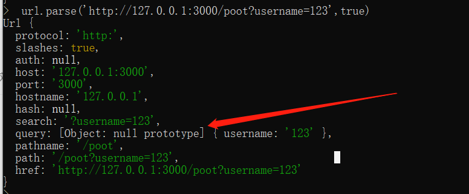

## 留言板


node 的 url.parse( ' 请求路径 ' )的方法（ get提交后的url?XXXXXXXXXX 一大串字符   将路径解析为一个方便操作的对象，第二个参数为true表示直接将查询字符串转为一个对象，通过query属性进行访问 ）

**用get请求发送无法将查询的路径进行判断，要用url.parse()封装的方法 **

```javascript
//用form表单  <form action="01.html" method="get"></form>

var http = require(' http ');
http.
server(function( req , res )=>{
        
        var parseObj = url.parse(req.url,true);
		var pathname = parseObj.pathname;//直接获得真正的url地址
		
		//解析成一个对象，好操作
		res.end(stringify(parseObj.query))//获取get提交后？后的内容
       })
       .listen(3000,()=>{
           console.log('listen on....');
       })

```




**思路：把form输入的内容放在comment数组中，用模板引擎直接渲染在客户端**

```javascript
var com=parseObj.query;
com.dataTime = '22.01';
//unshift 把数据放在数组最前面    push 把数据放在数组最后面
comment.unshift(com);//将用户输入的数据用url自带的封装成一个对象，再放到comment数组，方便模板引擎渲染
```


```javascript
var http = require('http');
var fs = require('fs');

// 需要把template包放在项目中（ 目录中 ）
var template = require('art-template');

var comment = [{
    name: 'lhy',
    message: '真的好爱你'
}, {
    name: 'xzy',
    message: '真的好爱你'
}]

http.
createServer(function(req, res) {
        var url = req.url;
        if (url === '/') {
            fs.readFile('./html/comment.html', (err, data) => {
                if (err) {
                    return res.end('404 Not Found');
                }
                // 模板引擎渲染
                var htmlStr = template.render(data.toString(), {
                    comment: comment
                })
                res.end(htmlStr);
            })
        } else if (url.indexOf('/public/') === 0) {
            fs.readFile('.' + url, (err, data) => {
                if (err) {
                    return res.end('404 Not Found');
                }
                res.end(data);
            })
        } else {
            fs.readFile('./404/index.html', (err, data) => {
                if (err) {
                    return res.end('404 Not Found');
                }
                res.end(data);
            })
        }
    })
    .listen(3000, () => {
        console.log('listening on....');
    })
```

##### html

```html
<body>
    
          <div id="lyb_box">
            <!-- 模板字符串：===> -->
            {{each comment}}
            <div class="lyb_outputleft">
                
                <span class="spanoutput1 floatleft">{{ $value.message }}</span>
                <div style="clear:both"></div>
            </div>
            {{/each}}


        </div>
</body>
```


- **注意：**服务端这个时候已经把数据存储好了，接下来就是让用户重新请求 / 首页，就可以看到最新的留言内容

- 然后通过服务器让客户端重定向

  + 状态码设置为302 临时重定向 （ 301 永久重定向 ）

  `statusCode`

  + 在响应头中通过 Location 告诉客户端往哪重定向

  ` setHeader`

- 如果客户端发现服务器的响应的状态码是 302 就会自动去响应1头中找Location然后对该地址发送新的请求

- 所以就能看到客户端自动跳转了

```javascript
res.statusCode=302;
res.setHeader('Location','/');//url根路径
//不需要响应数据  即不需要res.end();
```

